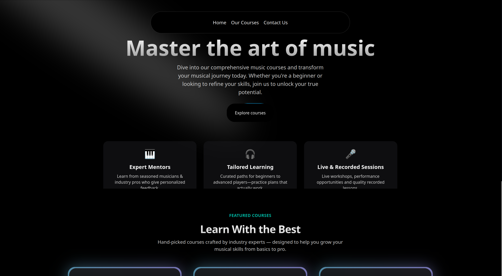
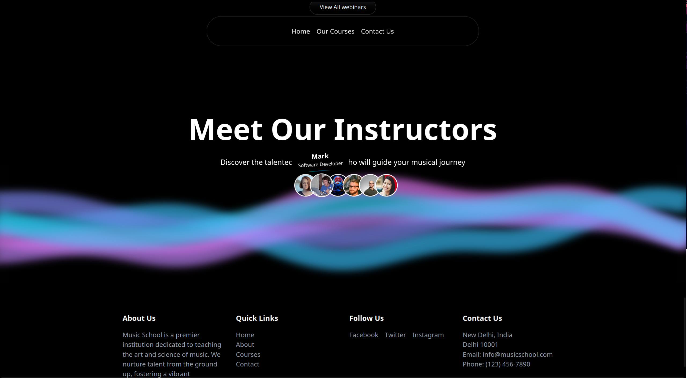
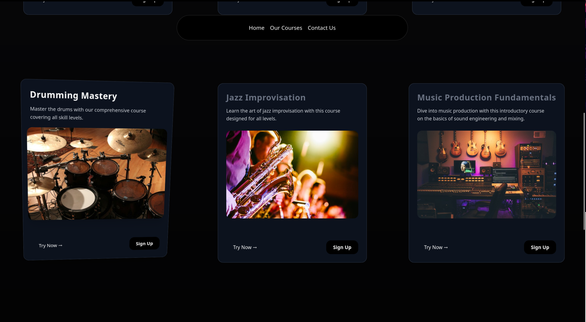
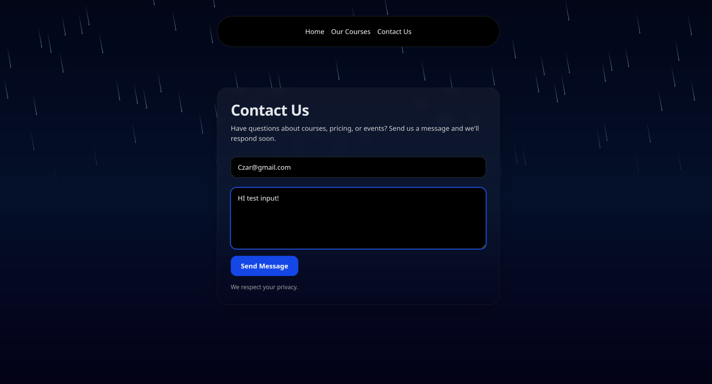

# Music Mentor

A music education website built with Next.js, React, TypeScript, and Tailwind CSS. Music Mentor showcases music courses, instructors, student testimonials, and webinar topics through a responsive interface with animated backgrounds and interactive cards.

## Screenshots

### Home



### Home — additional sections



### Course catalog



### Contact



## Features

- **Course discovery:** Browse courses covering instruments, vocals, songwriting, and music production, with images and descriptions.
- **Featured content:** Explore selected courses, instructor profiles, student testimonials, and webinar topics on the home page.
- **Interactive visuals:** 3D course cards, hover effects, scrolling animations, and meteor and wave backgrounds.
- **Responsive layouts:** Course grids and page sections adapt to different screen sizes.
- **Contact interface:** Email and message fields with browser validation.

The project currently showcases the frontend experience. Course enrollment, user accounts, webinar registration, and contact message delivery are not connected to backend services.

## Tech stack

| Technology | Purpose |
| --- | --- |
| Next.js 16 | App Router and page rendering |
| React 19 | UI components |
| TypeScript 5 | Type checking |
| Tailwind CSS 4 | Styling and responsive layouts |
| Motion | UI animations |
| Lucide React | Icons |

## Getting started

### Prerequisites

- Node.js **20.9 or newer**, as required by the project's Next.js version.
- npm, with the included `package-lock.json`.

### Run locally

From the project directory, install dependencies and start the development server:

```bash
npm ci
npm run dev
```

Open [localhost:3000](http://localhost:3000) in your browser.

### Available commands

| Command | Description |
| --- | --- |
| `npm run dev` | Start the development server |
| `npm run build` | Create a production build |
| `npm start` | Serve the production build |
| `npm run lint` | Run ESLint |

To run a production build locally:

```bash
npm run build
npm start
```

## Pages

| Route | Content |
| --- | --- |
| `/` | Hero, featured courses, learning highlights, testimonials, webinars, and instructors |
| `/courses` | Full course catalog |
| `/contact` | Contact form interface |

## Project structure

```text
music-mentor/
├── public/
│   ├── courses/                 # Course images
│   └── screenshots/             # App screenshots used in this README
├── src/
│   ├── app/
│   │   ├── contact/page.tsx      # Contact page
│   │   ├── courses/page.tsx      # Course catalog
│   │   ├── globals.css           # Global styles and Tailwind configuration
│   │   ├── layout.tsx            # Shared page layout
│   │   └── page.tsx              # Home page
│   ├── components/
│   │   └── ui/                   # Reusable animated UI components
│   ├── data/
│   │   └── music_courses.json    # Course catalog data
│   └── lib/
│       └── utils.ts              # Shared utilities
├── next.config.ts
├── package.json
└── package-lock.json
```

## Customization

- Update `src/data/music_courses.json` to change course titles, descriptions, images, and featured status.
- Add course images to `public/courses/` and reference them with paths such as `/courses/guitar.jpg`.
- Edit the components in `src/components/` to update home page content, instructors, testimonials, and webinar topics.
- Adjust `src/app/globals.css` and component classes to change styling.

## Contact

Find the creator on [X — @itsCzar16](https://twitter.com/itsCzar16).
